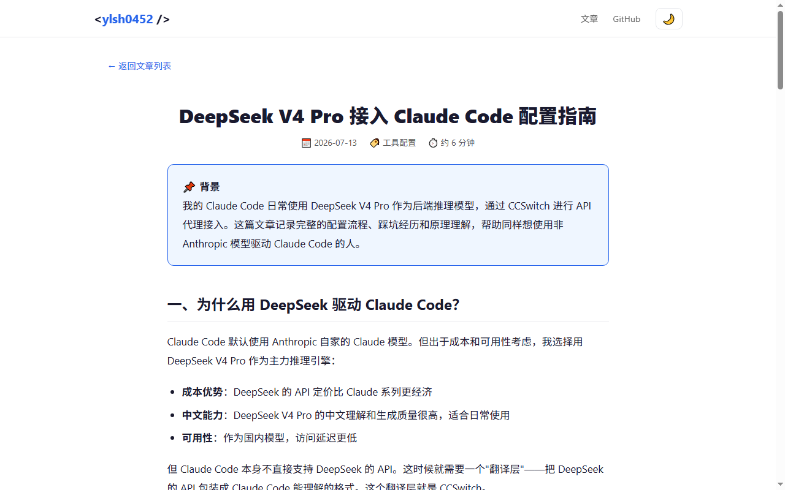

# AI 工作流程记录

> **说明**：以下流程为任务完成后复盘整理，非实时记录。各步骤的耗时和分工是事后回顾总结的，实际对话更零散、更随意。

---

## 第一步：明确任务目标

**我做了什么**：
- 阅读 DEEP 营任务二要求，理解需要选择一个真实场景、完成具体交付物
- 回顾任务一的《个人壁垒路线图》，发现其中写了"建立技术输出，累计 10+ 篇"但尚未启动
- 决定以"搭建个人技术博客 + 产出 3 篇技术文章"作为任务二场景

**AI 做了什么**：
- 我将任务一全部文档（壁垒方向卡、工具定位表、信息差观察、路线图、复盘）提供给 Claude Code 作为上下文
- 我向 AI 描述了路线图中"建立技术输出"的目标和当前进度为 0 的情况
- AI 基于这些上下文，建议博客场景与我的路线图方向最匹配

**我如何判断 AI 输出是否可用**：
- AI 的建议跟我的直觉一致——我本来就想写博客，AI 只是确认了这个方向
- 如果 AI 建议了其他场景（比如做数据可视化项目），我会拒绝，因为跟路线图不符

**我做了哪些人工修改**：
- 场景选择最终是我自己拍的板，AI 的角色是确认而非决策

---

## 第二步：准备输入材料

**我做了什么**：
- 整理了任务一仓库的全部 6 份 Markdown 文档作为原始输入
- 明确了博客的技术约束：纯 HTML/CSS/JS、无框架、响应式、暗色模式
- 确定了 3 篇文章的选题方向（全部来自自己的实际经验）

**AI 做了什么**：
- 读取了我提供的任务一文档，提取了我的技术栈、工具偏好、学习阶段等信息
- 基于这些信息，AI 后续生成的代码风格和文章内容都匹配我的实际水平

**我如何判断 AI 输出是否可用**：
- 原始材料全部来自我自己的任务一产出，不存在 AI 编造我的背景
- 如果 AI 基于错误理解生成了不符合我实际的内容，我能立刻识别

**我做了哪些人工修改**：
- 无。这一步是准备输入，不涉及 AI 输出

---

## 第三步：使用 AI 进行任务拆解

**我做了什么**：
- 向 Claude Code 描述了完整的博客需求（见 prompts.md #1）
- 指定了目录结构：`docs/` 下分 `css/`、`js/`、`articles/`

**AI 做了什么**：
- 自行规划了文件创建顺序：先 CSS → 再 HTML 首页 → 再文章详情页 → 最后 JS
- 将"搭建博客"这个模糊任务拆成了 7 个具体文件和一个清晰的执行顺序

**我如何判断 AI 输出是否可用**：
- 检查了文件创建顺序是否合理（CSS 在前是对的，否则 HTML 没有样式）
- 检查了目录结构是否符合 GitHub Pages 的 `/docs` 部署要求

**我做了哪些人工修改**：
- AI 的拆解方案我没有改动——文件划分和创建顺序都很合理

---

## 第四步：使用 AI 生成初稿或初步结果

**我做了什么**：
- 向 AI 提供了每篇文章的内容方向和大纲
- 指定了设计风格偏好：简洁、中性色、技术博客风格

**AI 做了什么**：
- 生成了完整的 `style.css`（约 250 行），包含 CSS 变量系统、暗色模式、响应式断点
- 生成了 `index.html`（首页，hero 区 + 3 张文章卡片）
- 生成了 3 篇文章的完整 HTML 页面
- 生成了 `main.js`（主题切换逻辑）

**我如何判断 AI 输出是否可用**：
- 在浏览器中打开了生成的 HTML 文件，实际看了效果
- 检查了暗色模式切换是否正常、响应式是否生效
- 检查了文章内容的个人经验部分是否准确（例如 CCSwitch 配置步骤是否跟我的实际配置一致）

**我做了哪些人工修改**：
- 移除了 AI 给文章卡片加的图片占位符（暂无配图，纯文字卡片更干净）
- 改了首页 hero 区标题，从"欢迎来到我的博客"改成"用 AI 写代码，用手写思考"
- 删除了文章 2 中 AI 生成的一段"产品营销式"开场白


---

## 第五步：人工检查和修改

**我做了什么**：
- 逐篇通读 3 篇文章，检查每个技术细节的准确性
- 对照自己的实际使用经验，验证文章中的踩坑记录是否真实
- 检查 CSS 暗色模式下的颜色对比度是否够

**AI 做了什么**：
- 根据我的反馈进行了针对性修改（调整暗色模式代码块背景色、修改文章段落措辞）

**我如何判断 AI 输出是否可用**：
- 技术准确性由我自己验证——我知道 CCSwitch 配置的实际步骤，能判断 AI 写的是否正确
- 个人经验部分只有我自己能判断——AI 写的"踩坑记录"如果跟我的实际经历不符，我会直接删改

**我做了哪些人工修改**：
- 修改了暗色模式下的代码块背景色（初始版本对比度不够）
- 删除了文章 2 中一段听起来像产品文案的开场，换成白话解释
- 统一了 3 篇文章的语气——AI 偶尔会在技术教程和口语化之间飘忽
- 文章 3 中的"项目_v3_真的最终版_改.html"段子是我自己写的，AI 想不出来

---

## 第六步：二次优化

**我做了什么**：
- 根据 DEEP 营官方对任务二的各项细化要求，补充了缺失的文档
- 检查了仓库结构是否与官方建议一致
- 检查了文章字数是否达到目标

**AI 做了什么**：
- 新增了 `ai_tools.md`（工具选择与分工表）
- 新增了 `sources/raw_inputs.md`（原始输入材料）
- 重写了 `scenario_description.md` 使其按 6 问结构组织
- 重写了 `task_goal.md` 使其匹配合格示例格式
- 补充了各文档的诚实性声明（估算标注、事后整理声明）

**我如何判断 AI 输出是否可用**：
- 对照官方要求逐项检查，确认没有遗漏
- 检查文档中的具体数据是否与实际情况一致（如字数、文件路径）
- 发现 reflection.md 中"截图待补充"和"部署待完成"是旧状态，要求 AI 更新

**我做了哪些人工修改**：
- 降低了 task_goal.md 中的文章字数目标使其与实际一致（2000→1700）
- 确认了"事后整理"和"估算"标注的位置是否诚实



---

## 第七步：整理最终交付物

**我做了什么**：
- 删除冗余的 `deliverables/` 目录
- 确认 `docs/` 和 `outputs/` 中内容一致
- 用 Edge headless 模式自动截取了 3 张过程截图
- 逐文件检查了所有文档中的交叉引用是否指向正确的文件名

**AI 做了什么**：
- 执行了 `git rm`、`git mv` 等操作完成文件重组
- 更新了 README 导航表格使其与实际文件结构一致
- 修复了 `ai_workflow.md` 中引用的旧文件名（key-prompts → prompts）

**我如何判断 AI 输出是否可用**：
- 在浏览器中打开了 GitHub Pages 链接，确认所有页面正常渲染
- 用 `curl` 验证了 4 个页面全部返回 HTTP 200
- 逐条核对了 README 中的链接是否指向实际存在的文件

**我做了哪些人工修改**：
- 最终目录结构的决策（docs/ 用于 Pages，outputs/ 用于交付物展示）

---

## 第八步：上传 GitHub 并完成复盘

**我做了什么**：
- 创建 GitHub 仓库 `deep-camp-task2-yourname`
- 配置 SSH 密钥推送代码
- 启用 GitHub Pages（`main` 分支 + `/docs` 目录）
- 编写任务复盘（reflection.md）

**AI 做了什么**：
- 执行了所有 git 操作（init、add、commit、push）
- 生成了复盘文档的初稿框架
- 帮助整理了完整的 Prompt 清单（事后根据记忆）

**我如何判断 AI 输出是否可用**：
- GitHub Pages 部署后，在浏览器中实际访问验证
- 复盘内容对照了自己的实际感受，确保不是 AI 替我写的"正确的话"

**我做了哪些人工修改**：
- 复盘中的三个认知收获（"AI 辅助 ≠ AI 代劳""启动门槛是最被低估的价值""写作能力反而更重要"）是我自己的真实体会，AI 只做了文字整理
- 不足部分的"截图滞后"是我实际犯的错，AI 不知道这件事

---

## 工作流总结

```
第一步 明确目标 ──→ 人决策（选博客场景），AI 确认
第二步 准备材料 ──→ 人整理（任务一文档），AI 读取
第三步 任务拆解 ──→ AI 规划（文件顺序），人审查
第四步 生成初稿 ──→ AI 生成（CSS/HTML/JS/文章），人看效果
第五步 人工检查 ──→ 人验证（技术准确性 + 个人经验），AI 修改
第六步 二次优化 ──→ 人发现遗漏（官方要求），AI 补充文档
第七步 整理交付 ──→ 人决策（目录结构），AI 执行（git 操作）
第八步 上传复盘 ──→ 人反思（收获与不足），AI 整理文字
```

**核心模式**：每一步都是**人先做判断，AI 后做执行**。AI 从来没有独自完成任何一步——每一步都有人工检查和修改环节。
